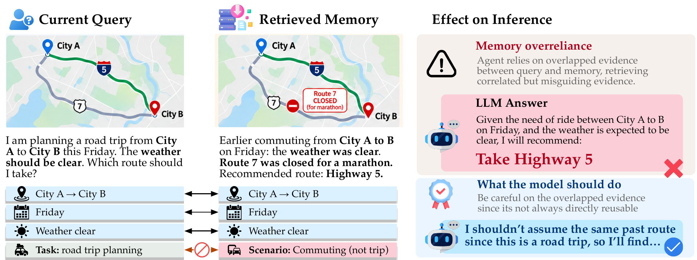
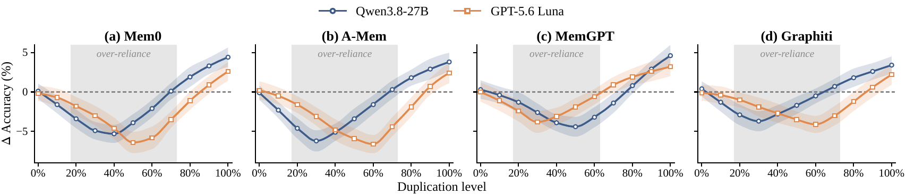
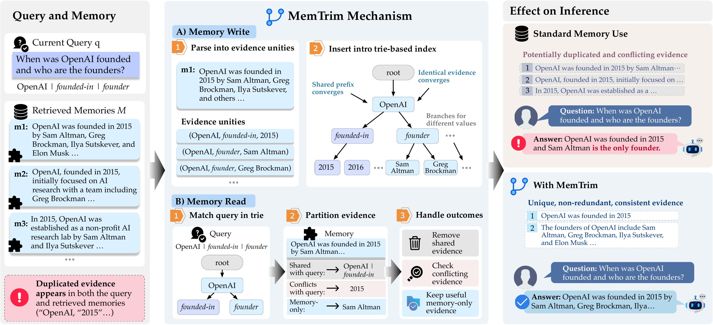

# MEMTRIM

<p align="center">
  <b>Mitigating inference-time overreliance in agentic memory</b>
</p>


<p align="center">
  <a href="#overview">Overview</a> ·
  <a href="#key-observation">Key Observation</a> ·
  <a href="#method">Method</a> ·
  <a href="#data">Data</a> ·
  <a href="#quick-start">Quick Start</a> .
  <a href="#minimal-rq1-evaluation">Evaluation</a>
</p>

---

## Overview

Agentic memory allows language-model agents to reuse information from previous
interactions. However, a retrieved memory can remain highly similar to the
current query while the information that determines the correct answer has
changed.

In this setting, the memory is still relevant enough to be retrieved, but its
previous reasoning or conclusion may no longer apply. Reusing it without
distinguishing reusable from non-reusable evidence can therefore hurt current
inference.

<p align="center">
  
</p>

We refer to this failure mode as **memory overreliance**.

MEMTRIM is designed to reduce this effect by explicitly separating evidence
that is already present in the current query, evidence that conflicts with the
current query, and useful information that exists only in memory.

---

## Key Observation

Our empirical analysis studies how the effect of memory changes as the amount
of evidence duplicated between the current query and retrieved memory varies.

<p align="center">
  
</p>

In the figure above:

- the **x-axis** shows the fraction of evidence duplicated between the current
  query and retrieved memory;
- the **y-axis** shows the accuracy change relative to the corresponding
  no-memory setting;
- negative values indicate that adding memory hurts accuracy.

The strongest degradation appears under **partial / intermediate duplication**.
When overlap is very small, memory has limited influence. As duplication
increases, the retrieved memory becomes influential enough to steer the model,
even though some answer-relevant information may still differ. Performance
recovers as duplication approaches full overlap.

This observation motivates MEMTRIM: repeated evidence should not automatically
receive additional influence simply because it appears again in retrieved
memory.

---

## Method

MEMTRIM is a plug-and-play layer around an existing memory system. The base
memory system continues to store complete memories and perform retrieval;
MEMTRIM operates at memory write time and after retrieval, before the resulting
context is passed to the language model.

<p align="center">
  
</p>

A stored memory is represented as

```text
m = (E_m, tau_m, H_m, o_m)
```

where:

| Symbol | Meaning |
|---|---|
| `E_m` | Canonical evidence units extracted from the stored interaction |
| `tau_m` | Task signature describing what the interaction asks the model to determine |
| `H_m` | Evidence supporting the stored outcome |
| `o_m` | Stored outcome |

Each evidence unit is represented as a canonical key-value pair:

```text
e = (key, value)
```

### Write time

MEMTRIM decomposes each memory into evidence units and inserts them independently
into a trie-backed evidence index.

```text
Stored memory
    ↓
Evidence units + task signature + support evidence + stored outcome
    ↓
Trie-backed evidence index
```

The complete memory remains in the original memory store. The trie is an
additional evidence-level index and does **not** replace the base retriever.

### Read time

The underlying memory system first retrieves its usual candidate memories.
MEMTRIM then compares their evidence with the current query.

```text
Current query + retrieved memories
    ↓
Partition evidence
    ↓
Shared / Conflicting / Memory-only
    ↓
Support-aware outcome handling
    ↓
Non-redundant memory context
```

The main rules are:

| Component | MEMTRIM behavior |
|---|---|
| **Shared evidence** | Do not repeat it in the memory context |
| **Conflicting evidence** | Remove the memory value; the current query takes precedence |
| **Memory-only evidence** | Retain useful additional information |
| **Stored outcome** | Suppress it if evidence supporting that outcome conflicts with the current query |
| **Repeated retained evidence** | Emit identical evidence only once |

If the stored and current tasks differ, a previous outcome can only be reused
when it has an explicit evidence representation. Otherwise, it is omitted.

---

## Data

### Datasets used in the paper

The full study evaluates memory overreliance under three representative forms of
answer-relevant change.

| Dataset | Setting | What changes? | Memory-overreliance scenario |
|---|---|---|---|
| **RippleEdits** | Outdated knowledge | Entity / world state | A previously correct stored fact becomes outdated |
| **CounterLogic** | Query change | Current question | A similar scenario is revisited with a different question |
| **CLADDER-anti** | Premise change | Answer-relevant premise | An intervention changes the premise supporting the previous answer |

Although the source of the change differs across datasets, they share the same
basic structure: much of the current query remains similar to the stored
interaction, while the information that determines the correct answer has
changed.

### Match vs. mismatch

Evaluation examples are divided into two groups:

| Split | Definition |
|---|---|
| **Match** | The answer-relevant condition remains unchanged, so the stored answer still applies |
| **Mismatch** | The answer-relevant condition changes, so the stored answer should no longer be reused |

This distinction allows us to measure whether a memory method removes harmful
reuse under mismatch while preserving useful memory under match.

### Included toy data

This minimal repository includes:

```text
data/rq1_toy.jsonl
```

The file contains a small synthetic dataset used to demonstrate the RQ1 metric
implementation.

Each JSONL record contains:

| Field | Description |
|---|---|
| `id` | Example identifier |
| `split` | `match` or `mismatch` |
| `gold_answer` | Ground-truth answer |
| `no_memory_prediction` | Prediction produced without retrieved memory |
| `memory_prediction` | Prediction after memory is introduced |

The bundled examples are **synthetic**. They are included only to demonstrate
the evaluation code and metric definitions. They are **not** the paper's full
experimental datasets and are **not** paper results.

---

## Quick Start

The minimal implementation uses only the Python standard library.

**Recommended:** Python 3.10+

### 1. Clone the repository

```bash
git clone <ANONYMOUS_REPOSITORY_URL>
cd MEMTRIM
```

### 2. Check the package

```bash
python -c "import memtrim; print('MEMTRIM import successful')"
```

Expected output:

```text
MEMTRIM import successful
```

### 3. Run the MEMTRIM demo

```bash
python scripts/demo.py
```

The demo constructs one stored memory and evaluates two cases.

**Match**

The answer-supporting evidence remains unchanged, so the previous outcome may
remain available.

**Mismatch**

Answer-supporting evidence changes, so the previous outcome is suppressed while
useful memory-only evidence is retained.

### 4. Run the minimal RQ1 evaluator

```bash
python scripts/run_rq1_minimal.py
```

This computes no-memory accuracy, memory accuracy, and prediction-transition
metrics separately for match and mismatch examples.

### 5. Run the context-merging tests

```bash
python -m unittest tests/test_context_merge.py
```

The tests cover:

- legitimate multi-valued evidence;
- identical evidence across multiple memories;
- evidence deduplication;
- unresolved conflicting values across memories.


| Metric | Definition |
|---|---|
| **No-memory accuracy** | Accuracy before memory is introduced |
| **Memory accuracy** | Accuracy after memory is introduced |
| **Correct → Wrong (`✓→✗`)** | Prediction was correct without memory and becomes incorrect after adding memory |
| **Wrong → Correct (`✗→✓`)** | Prediction was incorrect without memory and becomes correct after adding memory |


---

## Experimental Setup in the Paper

The full study evaluates the phenomenon and the mitigation across multiple
datasets, memory organizations, and model backbones.

| Component | Setting |
|---|---|
| **Datasets** | RippleEdits, CounterLogic, CLADDER-anti |
| **Memory systems** | Mem0, A-Mem, MemGPT, Graphiti |
| **Evaluation groups** | Match / Mismatch |
| **Main metrics** | Accuracy, correct→wrong, wrong→correct |
| **Overlap analysis** | Query-memory overlap |
| **Controlled analysis** | Evidence-duplication level |
| **Models** | One open-weight model and one API-based model |

The complete paper additionally evaluates mitigation baselines, ablations,
strong-memory cases, adversarial memory settings, and runtime overhead.

This repository is intentionally a **compact reference implementation of the
core MEMTRIM mechanism**. It does not include the full external-memory-system
integrations, complete baseline suite, attack experiments, or the complete
paper reproduction pipeline.

---

## Repository Structure

```text
MEMTRIM/
├── assets/
│   ├── memtrim_intro.png
│   ├── memtrim_method.png
│   └── rq3_duplication.png
│
├── data/
│   └── rq1_toy.jsonl
│
├── memtrim/
│   ├── __init__.py
│   ├── core.py
│   ├── schema.py
│   └── trie.py
│
├── scripts/
│   ├── demo.py
│   └── run_rq1_minimal.py
│
├── tests/
│   └── test_context_merge.py
│
├── .gitignore
├── README.md
└── requirements.txt
```

### Core files

| File | Purpose |
|---|---|
| `memtrim/schema.py` | Dataclasses for evidence, memories, parsed queries, and transformation results |
| `memtrim/trie.py` | Minimal trie-backed evidence index |
| `memtrim/core.py` | Write-time indexing and read-time MEMTRIM context construction |
| `scripts/demo.py` | Small executable match/mismatch example |
| `scripts/run_rq1_minimal.py` | Minimal RQ1 metric implementation |
| `data/rq1_toy.jsonl` | Synthetic examples for the minimal evaluator |
| `tests/test_context_merge.py` | Regression tests for context merging behavior |

